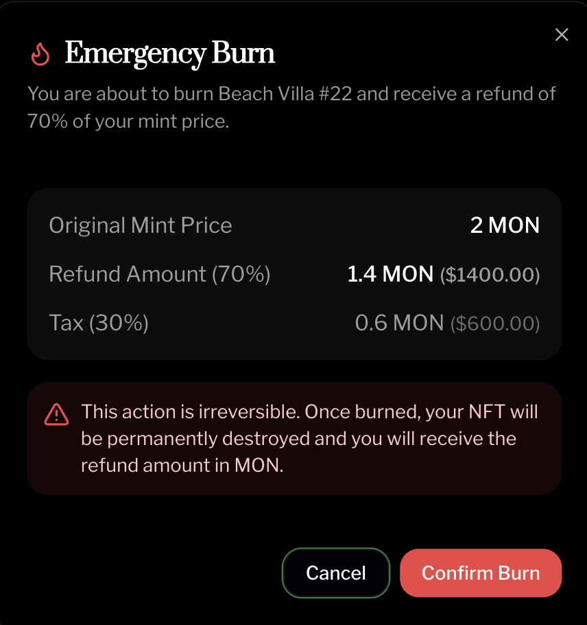

# Choosing Your Market Type: Complete Decision Guide

Your market type determines how Patron Cards are sold. This decision affects pricing, FOMO dynamics, and community perception.

Three market types available: SteppedMarket, FixedMarket, and MembersMarket.

## Quick Comparison

| Feature | SteppedMarket | FixedMarket | MembersMarket |
|---------|---------------|-------------|---------------|
| **Pricing** | Increases per batch | Same for everyone | Variable or fixed |
| **Bot Resistance** | High | Medium | High |
| **FOMO Factor** | High | Medium | Very high |
| **Complexity** | Medium | Low | Medium |
| **Best For** | Most launches | Established projects | Exclusive clubs |
| **Fairness** | Early bird rewards | Equal access | Member-only |

**Most founders choose SteppedMarket**. It balances FOMO, fairness, and bot resistance.

<figure><figcaption></figcaption></figure>

## SteppedMarket: Batch-Based Pricing

### How It Works

Cards sell in batches. Price increases after each batch sells out.

**Example configuration**:
- Total supply: 100 cards
- Batch size: 10 cards
- Starting price: 0.5 ETH
- Price increment: 0.05 ETH per batch

**Resulting prices**:
- Batch 1 (cards 1-10): 0.50 ETH each
- Batch 2 (cards 11-20): 0.55 ETH each
- Batch 3 (cards 21-30): 0.60 ETH each
- ...
- Batch 10 (cards 91-100): 0.95 ETH each

**Total raised**: 70 ETH (approximately $140k at $2k ETH)

### Key Benefits

**Early bird advantage without bot dominance**: First supporters save money, but bots can't buy everything instantly because batch pricing removes urgency within each batch.

**Creates sustained FOMO**: As batches sell, latecomers see price increasing and feel urgency to buy now.

**Rewards commitment level**: Supporters who act fast get better prices. Higher prices later mean higher LP allocation and PatronPower weight.

**Psychological pricing power**: Watching batches sell out creates momentum. "Batch 7 is 80% sold!" drives action.

<figure><figcaption></figcaption></figure>

### When to Choose SteppedMarket

**Ideal for**:
- New projects building community
- Projects wanting to reward early supporters
- Launches needing sustained momentum
- Communities with mixed commitment levels

**Best if you**:
- Want to balance fairness and FOMO
- Need price discovery (what will market pay?)
- Have active marketing during sale
- Want bot resistance built-in

### Configuration Guidelines

**Batch size**:
- Too small (1-5 cards): Creates artificial scarcity, may frustrate supporters
- Sweet spot (10-20 cards): Balances accessibility and urgency
- Too large (50+ cards): Reduces FOMO, feels like fixed pricing

**Price increment**:
- Conservative (5-10% per batch): Smooth price curve, predictable
- Moderate (10-20% per batch): Noticeable increases, stronger FOMO
- Aggressive (20%+ per batch): High FOMO, risk of stalling later

**Starting price**:
- Set below market clearing price
- Early supporters should feel they're getting a deal
- Typical: 30-50% below expected final price

### Example: $500k Raise

**Target**: Raise $500k (250 ETH at $2k/ETH)

**Configuration**:
- Total cards: 500
- Batch size: 50
- Starting price: 0.4 ETH
- Increment: 0.05 ETH per batch
- Final batch price: 0.85 ETH

**Average price**: Approximately 0.625 ETH

**Result**: 500 cards × 0.625 ETH average = 312.5 ETH raised (approximately $625k)

Exceeded target due to rising prices creating urgency.

## FixedMarket: Equal Price for All

### How It Works

Every card costs the same. First-come, first-served, but no price advantage.

**Example configuration**:
- Total supply: 200 cards
- Fixed price: 0.5 ETH each

**Total raised**: 100 ETH (approximately $200k)

### Key Benefits

**Maximum simplicity**: Easy to explain. "Each card costs 0.5 ETH. Buy as many as you want."

**Perceived fairness**: Everyone pays the same price. No early bird advantage controversy.

**Predictable fundraising**: You know exactly how much you'll raise if you sell out.

**Less time pressure**: Supporters don't rush to avoid price increases.

### When to Choose FixedMarket

**Ideal for**:
- Projects with established communities
- Launches prioritizing simplicity
- Communities valuing equality
- Projects with strong brand (don't need FOMO)

**Best if you**:
- Have pre-existing demand
- Don't need price discovery
- Want simplest possible user experience
- Value equality over early bird rewards

### Configuration Guidelines

**Pricing strategy**:
- Calculate: Target Raise / Desired Card Supply = Fixed Price
- Example: $200k target ÷ 200 cards = $1k per card = 0.5 ETH at $2k ETH

**Supply considerations**:
- More cards = lower individual price = more accessible
- Fewer cards = higher individual price = more exclusive
- Typical: 100-500 cards depending on raise size

**Market cap implications**:
- Your fixed price determines initial perception of value
- Too high: Supporters feel overpriced
- Too low: You raise less than needed
- Right price: Sells out within target timeframe

### Example: $1M Raise

**Target**: Raise $1M (500 ETH)

**Configuration**:
- Total cards: 250
- Fixed price: 2 ETH each

**Total raise**: 250 × 2 ETH = 500 ETH = $1M

Simple. Predictable. Requires strong existing community to sell 250 cards at 2 ETH each.

## MembersMarket: Exclusive Access

### How It Works

Only holders of specific NFTs can participate. Creates exclusivity and rewards existing community.

**Example configuration**:
- Total supply: 100 cards
- Gated by: Existing Project XYZ NFT ownership
- Pricing: Fixed or stepped (you choose)

Only Project XYZ NFT holders can mint. Creates VIP-only launch.

### Key Benefits

**Ultimate exclusivity**: Only your existing community can participate. Rewards loyalty.

**Bot resistance at maximum**: Bots need to own gating NFT first. High barrier to entry.

**Community strengthening**: Existing NFT holders feel valued. Creates tighter bonds.

**Multi-project synergies**: Partner with other projects by gating on their NFTs.

### When to Choose MembersMarket

**Ideal for**:
- Projects with existing NFT collections
- Exclusive clubs or DAOs
- Sequel projects (Project v2 for Project v1 holders)
- Partnership launches

**Best if you**:
- Have an existing NFT community
- Want to reward early supporters with exclusive access
- Don't need broad market access
- Value exclusivity over accessibility

### Configuration Guidelines

**Gating NFT selection**:
- Use your own existing collection (rewards your community)
- Partner with related project (expands to aligned audience)
- Multiple collections allowed (broader access while maintaining exclusivity)

**Pricing within MembersMarket**:
- Can use SteppedMarket logic (early bird advantages among members)
- Can use FixedMarket logic (equality among members)

**Supply management**:
- Limit to reasonable number given gating NFT supply
- If 1,000 holders of gating NFT, offering 100 Patron Cards creates healthy competition
- If only 100 holders, offering 100 cards means 1:1 access (less FOMO)

### Example: Sequel Launch

**Scenario**: You launched Project v1 last year. 500 v1 NFT holders exist. Now launching v2.

**Configuration**:
- Gating: Must hold v1 NFT
- Total v2 cards: 200
- Pricing: Stepped (0.5 ETH start, 0.05 ETH increment, batches of 20)

**Result**: v1 holders compete for 200 v2 cards. Not everyone gets one. Creates urgency while rewarding loyalty.

## Decision Framework

### Question 1: Do you have an existing NFT community?

**Yes** → Consider MembersMarket for exclusivity or FixedMarket for simplicity

**No** → Choose between SteppedMarket and FixedMarket

### Question 2: How important is FOMO?

**Critical** → SteppedMarket (rising prices create urgency)

**Moderate** → FixedMarket with limited supply

**Not important** → FixedMarket with ample supply

### Question 3: What's your community sophistication?

**Crypto-native, DeFi users** → SteppedMarket (they understand batch pricing)

**General audience, less technical** → FixedMarket (simpler to explain)

**Exclusive club** → MembersMarket (they're already committed)

### Question 4: How strong is existing demand?

**Very strong** → FixedMarket works (will sell out quickly regardless)

**Moderate** → SteppedMarket (need FOMO mechanics to drive completion)

**Building demand** → SteppedMarket (price increases create momentum)

### Question 5: What's your raise size?

**Small ($50k-$200k)** → FixedMarket or SteppedMarket with smaller increments

**Medium ($200k-$1M)** → SteppedMarket recommended (price discovery important)

**Large ($1M+)** → SteppedMarket (need strong FOMO to reach target)

## Real-World Scenarios

### Scenario 1: New DeFi Protocol

**Situation**: Launching new protocol. No existing community. Need to raise $300k. Crypto-native audience.

**Best choice**: SteppedMarket

**Configuration**:
- 300 cards, batches of 30, start at 0.3 ETH, increment 0.03 ETH
- Creates FOMO, rewards early adopters, bot-resistant
- Total raise: ~115 ETH (approximately $230k) + momentum often exceeds target

### Scenario 2: Established Project Expansion

**Situation**: Already have 1,000 NFT holders. Launching expansion. Need $500k. Loyal community.

**Best choice**: MembersMarket (gated on existing NFTs) with FixedMarket pricing

**Configuration**:
- 200 cards at 2.5 ETH each, only for existing NFT holders
- Rewards loyalty, creates exclusivity, simple pricing
- Total raise: 500 ETH = $1M at $2k ETH (exceeds target)

### Scenario 3: Community-First Gaming Project

**Situation**: Built Discord community of 500 engaged gamers. Need $100k. Less crypto-native audience.

**Best choice**: FixedMarket

**Configuration**:
- 200 cards at 0.5 ETH each
- Simple to understand, equal access, rewards all supporters equally
- Total raise: 100 ETH = $200k (exceeds target if community converts)

### Scenario 4: High-Growth Startup

**Situation**: Proven traction, raising $2M for scale. Mix of crypto and traditional investors interested.

**Best choice**: SteppedMarket with wider batches

**Configuration**:
- 500 cards, batches of 50, start at 1 ETH, increment 0.5 ETH
- Large enough for institutional participation, creates price discovery
- Total raise: 875 ETH (approximately $1.75M) + likely exceeds as FOMO kicks in

## Advanced Configuration Tips

### Optimizing Batch Size (SteppedMarket)

**Small batches (5-10 cards)**:
- Pros: Frequent price increases, constant FOMO
- Cons: May feel manipulative, harder to buy multiple
- Best for: Small raises, highly engaged communities

**Medium batches (10-30 cards)**:
- Pros: Balanced FOMO and accessibility
- Cons: None significant
- Best for: Most launches (recommended default)

**Large batches (30-100 cards)**:
- Pros: Easier for whales, less artificial scarcity
- Cons: Weaker FOMO dynamics
- Best for: Large raises, institutional participation expected

### Setting Price Increments

**Formula**: (Final Price - Starting Price) / Number of Batches = Increment

**Example target**: Want starting price 0.5 ETH, final price 1.0 ETH, 10 batches
- Increment: (1.0 - 0.5) / 10 = 0.05 ETH per batch

**Psychological pricing**:
- 0.05 ETH feels reasonable (10% increments)
- 0.10 ETH feels significant (20% increments)
- 0.25 ETH feels aggressive (50% increments)

### Calculating Total Raise

**SteppedMarket total**:

Formula: (Starting Price + Final Price) / 2 × Total Supply

Example: (0.5 + 1.0) / 2 × 100 cards = 0.75 × 100 = 75 ETH

**FixedMarket total**:

Formula: Fixed Price × Total Supply

Example: 0.5 ETH × 200 cards = 100 ETH

## Common Mistakes

### Mistake 1: Batches Too Small

**Problem**: 1-2 cards per batch feels manipulative. Supporters frustrated.

**Solution**: Minimum 5 cards per batch, ideally 10+.

### Mistake 2: Starting Price Too High

**Problem**: First batch doesn't sell, momentum stalls.

**Solution**: Start 30-50% below expected market clearing price.

### Mistake 3: Too Many Price Steps

**Problem**: 50 batches of 2 cards each = constant price changes, confusion.

**Solution**: Maximum 10-15 price steps for most launches.

### Mistake 4: Fixed Price Too High

**Problem**: Overpriced cards don't sell, raise fails.

**Solution**: Conservative pricing. Better to sell out fast than struggle.

### Mistake 5: Wrong Market for Audience

**Problem**: SteppedMarket for non-crypto audience causes confusion.

**Solution**: Match complexity to audience sophistication.

## Testing Your Configuration

### Before Launch, Simulate

**Calculate average price**:
- SteppedMarket: Use midpoint formula
- FixedMarket: Just the fixed price

**Calculate total raise**:
- Average price × supply = expected raise
- Does it hit your target?

**Model different scenarios**:
- What if only 70% sells? Do you hit minimum threshold?
- What if 100% sells in 24 hours? Is that okay?
- What if it takes 2 weeks? Does FOMO still work?

### Share With Community First

Before deploying:
- Explain your chosen market type
- Walk through the pricing
- Answer questions
- Gauge reaction

Supporters appreciate transparency. If they don't understand, simplify.

## Post-Choice Considerations

### You Cannot Change After Deployment

Market type and pricing are immutable once deployed. Choose carefully.

**If you realize you chose wrong**:
- Cannot modify existing contracts
- Would need to deploy new project (costs another $15)
- Lose momentum and community trust
- Better to get it right the first time

### Marketing Matches Market Type

**SteppedMarket**: Emphasize "early bird pricing" and "limited batches"

**FixedMarket**: Emphasize "equal access" and "simple pricing"

**MembersMarket**: Emphasize "exclusive" and "VIP access"

Your market type determines your messaging.

## Next Steps

Ready to deploy?

1. Choose your market type (SteppedMarket recommended for most)
2. Configure pricing parameters
3. Calculate expected raise
4. Share configuration with community for feedback
5. Deploy when ready

[View full launch process](./launch-process.md) →

[Calculate your costs](./pricing-and-economics.md) →

[See success stories](./success-stories.md) →

---

**Remember**: Most successful launches use SteppedMarket. It balances FOMO, fairness, and bot resistance. When in doubt, choose SteppedMarket with medium batches and moderate increments.
